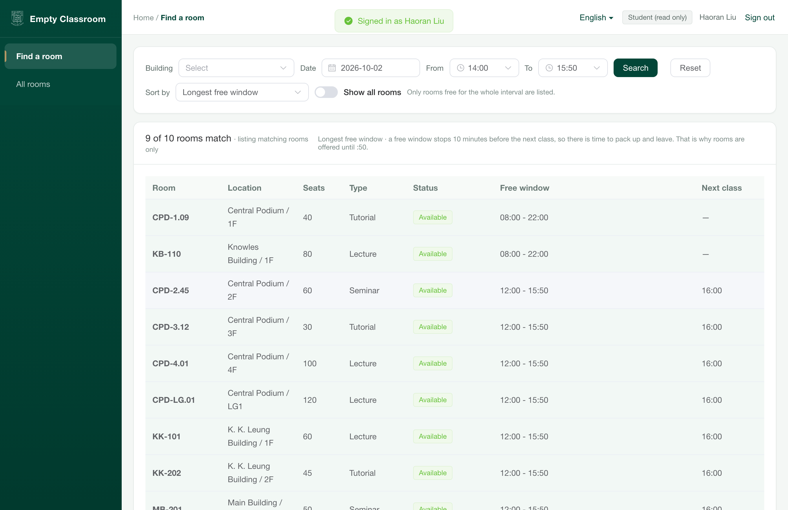
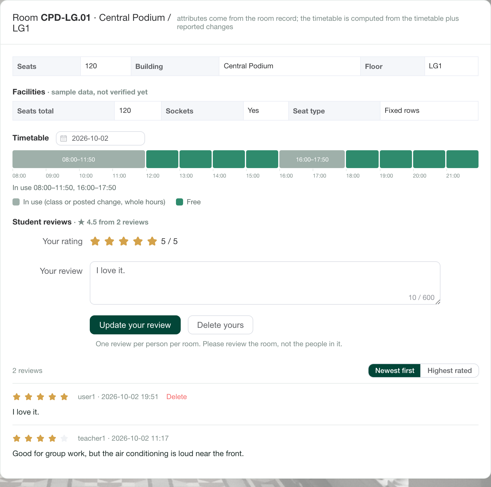
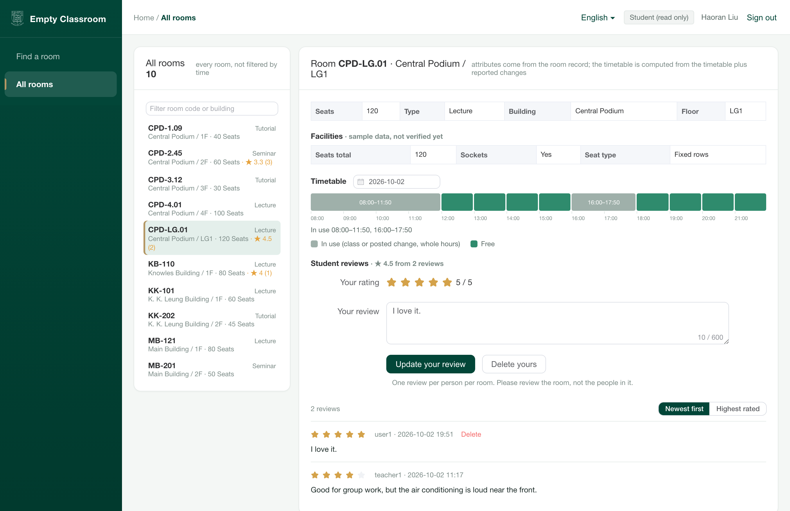
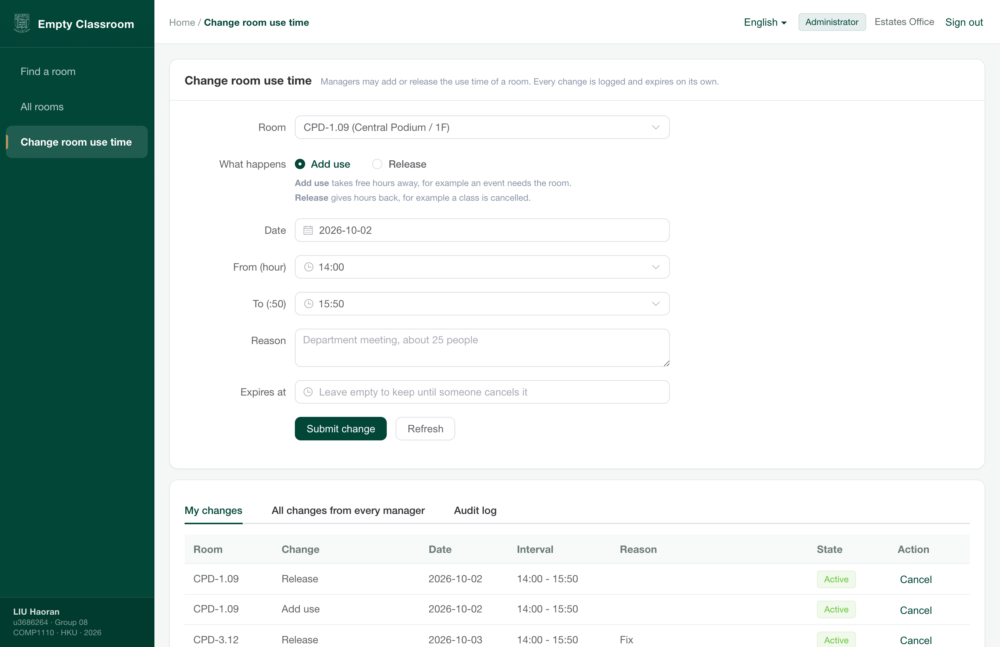
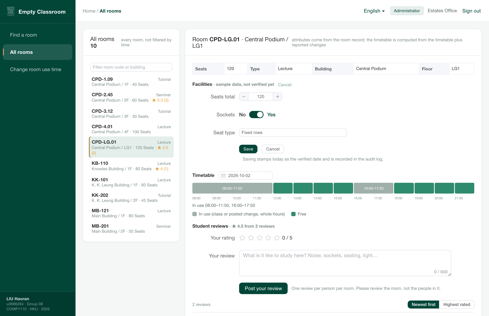
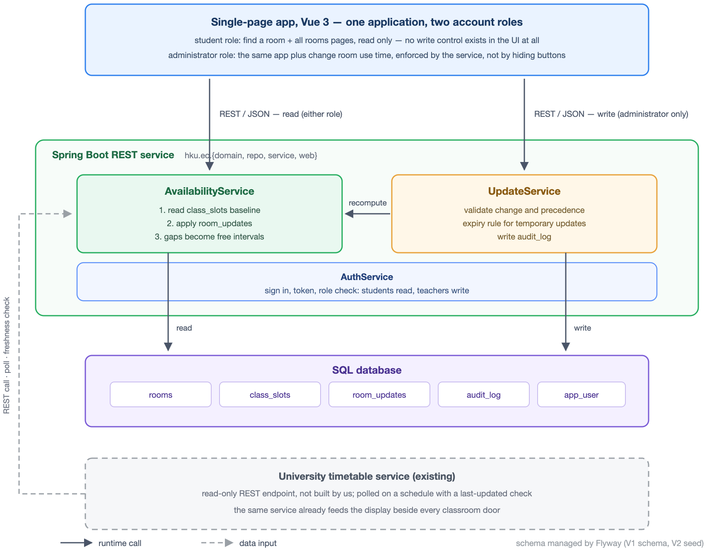

# Empty Classroom Plan

[English](README.md) · **简体中文** · [繁體中文](README.zh-TW.md)

> 回答一个关于港大教室的问题：**课间到底哪几间教室是空的？**
> Vue 3 + Spring Boot + PostgreSQL · COMP1110 第 08 组（香港大学）



---

## 这个项目解决什么问题

09:50 到 10:10 之间，港大每一栋教学楼的走廊里都挤着找座位的同学。他们问的是同一个问题——**附近有没有空教室？**——但没有人能在不走过去看看的情况下回答它。

回答这个问题需要的信息其实一直都在。学校有每周课表，而且它已经把数据推到了最末端：**每间教室门外都有一个显示屏，显示这间教室当天的课表**。缺的不是数据，而是一个把课表变成"**接下来这一小时哪几间教室空着**"的视图，给一个正站在走廊里的学生看。

本项目把决定"教室能不能用"的两件事合起来——**固定的周课表** 与 **管理人员发布的临时变更**（教室被活动占用、或某段不再使用）——然后报出剩下的空闲时间。它刻意只描述**房间，不描述人**：不猜房间里有几个人，也不要求学生预约任何东西。

## 功能

- **查询** —— 选日期、楼栋、时间窗（`14:00 → 15:50`），列出整段都空着的教室；每条结果标明"现在可用 / 稍后可用 / 正在使用"。
- **每间教室有自己的页面** —— 当天课表画成**以整点为格、以整块为单位的方格**（两小时的课就是跨两格的一整块，标签写真实时间 `13:00–14:50`）、设施（座位数、插座、座位类型）、以及其他同学的评价。
- **All rooms** —— 不按时间过滤的完整教室列表，可排序。
- **评价** —— 一人一房一条星级；管理员可删任何一条，删除留审计。
- **设施编辑** —— 座位数 / 插座 / 座位类型**只有管理员能改**；每次保存盖"最后核实时间"，从未核实过的房间在界面上明确标注。
- **管理端变更** —— 管理员可以**添加使用（add use）**或**释放时间（release）**，每次变更都有到期时间与审计记录。
- **注册** —— 任何 `hku.hk` 后缀的邮箱（`@connect.hku.hk`、`@hku.hk` 等）都可以用邮箱 + 密码注册学生账号。原型阶段**不发验证邮件**。

## 界面

| | |
|---|---|
| **按时间窗查询** | **教室详情页** |
|  |  |
| **All rooms** | **管理端变更** |
|  |  |
| **设施编辑（仅管理员）** | |
|  | |

## 怎么算的

核心一句话：**空闲 = 一天 减去 被占的块。**

把一天画成 08:00 到 22:00 的一条线，每节课、每个发布的变更都是一个涂黑的块；**没被涂黑的部分就是空闲时间**。"10:00 到 11:00 这间房空吗？"就变成"这一段是否整段落在没涂黑的地方"。后端做的就是把这些时间块**合并与相减**，并且每个块两侧各留 **10 分钟换场余量**——因为不能上课上到最后一分钟才算空出来。

而这些"被占的块"从哪来，才是最关键的部分：

| | |
|---|---|
| **占用以整块为单位** | 所有课整点开始、`:50` 结束，所以两小时的课占两个整块（`13:00–14:50`），绝不会占半块；管理员的变更同样以整块为单位。 |
| **学校课表优先级最高** | 管理人员发布的变更，只能占用**课表显示为空**的时间。任何与课重叠的变更会被服务端**直接拒绝**（`400 TIMETABLE_PRIORITY`），而不是默默接受一个不生效的变更。 |
| **学生影响不了占用** | 学生账号根本不存在写路径。拦截在**服务端**做，不是靠藏按钮：学生 token 调变更接口一律 `403`。 |
| **我们是去问，不是抄一份** | 学校课表从对方的**只读接口**读取、定期轮询，并用 `last-updated` 时间戳做新鲜度检查。我们不保存副本，绝不写对方系统。原型阶段这个来源仍是样例数据（见"限制"）。 |

### 服务端真正执行的规则

| 规则 | 实现位置 | 怎么验证的 |
|---|---|---|
| 起点整点、查询终点必须是 `:50` | `AvailabilityService.requireSearchWindow` / `requireWholeHours` | `from=14:30` → `400`；`to=16:00` → `400` |
| 管理员不得触碰课表里的课 | `UpdateService.create`（重叠判断） | 对课程时段发 `RELEASE`/`USE` → `400 TIMETABLE_PRIORITY` |
| 只有管理员能发布变更 | `AuthService.require(token, "admin")` | 学生 token → `403 FORBIDDEN` |
| 只有 `hku.hk` 邮箱能注册 | `AuthService.isHkuEmail` | `@gmail.com`、`@connect.hku.hk.evil.com` → `400` |
| 每次变更可追溯、可到期失效 | `room_updates`、`audit_log` | `GET /api/audit` |

## 架构



三个部分，**它们之间的分工就是设计本身**：

1. **一个 Vue 3 单页应用，两种账户角色。** 学生页面里不存在任何写控件；管理员页面是同一个应用外加若干路由，**能做什么由服务端决定**。
2. **一个 Spring Boot 服务**：计算空闲、执行上面的规则，是系统里**唯一会写数据的部分**。
3. **一个 PostgreSQL 数据库**：课表、发布的变更、审计日志、账号。

学校课表是**输入，不是我们要造的东西**。我们的服务按计划调用对方的只读接口并比对 `last-updated` 时间戳；数据变旧就说变旧，不假装是当前的。

## 快速开始

**环境要求：** Java 21、Maven、Node 18+、PostgreSQL 17（macOS 上 `brew install maven openjdk@21 postgresql@17 node`）。

```bash
git clone https://github.com/HenryLiu520/hku-empty-classroom.git
cd hku-empty-classroom

./scripts/start-all.sh      # 依次启动 PostgreSQL(5433) → Spring Boot(8080) → Vite(5173)
# 首次运行会装依赖并执行 Flyway 迁移，约 3–8 分钟
```

然后打开 **http://localhost:5173/login** 登录：

| 账号 | 角色 | 能看到什么 |
|---|---|---|
| `user1` | `user`（学生） | 只有查询与教室页——界面上不存在任何写入口 |
| `admin1` | `admin` | 同一个应用，外加 *Change room use time*、设施编辑、审计 |
| `teacher1` | `admin` | 第二个管理员，用来演示"管理员可以管理别的管理员提交的变更" |

种子密码在 `backend/src/main/resources/db/migration/V2__seed.sql`（账号名在 `V5__account_names.sql` 中改过）。

停止：`./scripts/stop-all.sh`。单独启停某一层：`scripts/start-db.sh`、`start-backend.sh`、`start-frontend.sh`。

命令行自测：

```bash
curl -s "http://localhost:8080/api/availability?date=$(date +%F)&building=CPD&from=14:00&to=15:50" | python3 -m json.tool | head -30
```

## 接口（原型版）

| 方法 | 路径 | 说明 |
|---|---|---|
| `POST` | `/api/auth/register` | 用 `hku.hk` 邮箱注册，返回 token |
| `POST` | `/api/auth/login` | 返回 token（内存保存 24 小时） |
| `GET` | `/api/buildings` | 楼栋列表 |
| `GET` | `/api/rooms?building=CPD` | 教室列表（含设施与评价均分） |
| `GET` | `/api/availability?date=&building=&from=&to=` | **主查询**：整段都空着的教室 |
| `GET` | `/api/rooms/{code}/timeline?date=` | 某教室一天的忙/闲/缓冲片段 |
| `POST` | `/api/updates` | 发布变更（`USE` / `RELEASE`）——仅管理员 |
| `GET` | `/api/updates/mine`、`GET`/`DELETE` `/api/updates[/{id}]` | 查看与撤销变更（撤销保留记录，只置为失效） |
| `PATCH` | `/api/rooms/{code}` | 编辑设施——仅管理员 |
| `GET` | `/api/rooms/{code}/reviews`、`POST`、`DELETE /api/reviews/{id}` | 评价（一人一房一条） |
| `GET` | `/api/audit` | 审计日志——仅管理员 |

## 测试

```bash
./scripts/test.sh        # 需要数据库在跑；脚本会先确保库起来
```

**21 个自动化用例全部通过**（9 个区间运算纯函数测试 + 10 个可用性/规则测试 + 2 个注册规则测试）。报告里会引用的边界算例：

| 算例 | 测试方法 | |
|---|---|---|
| 两节课之间的大空档可用 | `normalGapIsUsable` | ✓ |
| 背靠背两节课，中间不给窗口 | `backToBackGivesNoWindow` | ✓ |
| 间隙小于换场余量，不展示为可用 | `gapShorterThanBufferIsNotOffered` | ✓ |
| 释放只能撤销管理员自己加的占用 | `releaseOnlyCancelsAnAdminAddition` | ✓ |
| 释放永远挖不掉课表里的课 | `releaseCannotOverrideTheTimetable` | ✓ |
| 与课重叠的变更被直接拒绝 | `adminCannotChangeClassTime` | ✓ |
| 查询时刻正在上课 → 正在使用 | `duringClassIsInUse` | ✓ |
| 非整点时间被拒绝 | `offHourTimesAreRejected` | ✓ |
| 两小时的课是一整块（跨两格） | `timelineMergesWholeHourBlocks` | ✓ |
| 只有 `hku.hk` 邮箱能注册 | `RegistrationRulesTest`（2 例） | ✓ |

测试用 `@Transactional`，跑完自动回滚，**不会污染演示数据**。

## 性能（实测，2026-10-02）

| 指标 | 数值 |
|---|---|
| 查询接口吞吐 | **约 8,500 请求/秒**（并发 50–1000 都稳定） |
| 单请求延迟 | 5.9 ms @ 50 并发 · 121 ms @ 1000 并发 |
| 每请求 SQL 条数 | **3 条**（房间列表 + 当天课表 + 当天变更） |
| 最大压力实测 | 并发 1000 × 10 秒 → 84,713 次请求全部 `200`，0 错误 |

第一版每请求要发 **31 条 SQL**（每间房各查一次课表与变更，典型的 N+1），数据库因此成为瓶颈（约 1,100 请求/秒）。改成批量取回、在内存里按房间分组后降到 3 条，吞吐提升 **7.7 倍**。**没有用 Redis 是有意的**：单实例 + 只读为主 + 数据只有几 KB；Redis 的价值在多实例部署，而不是这个负载。

## 目录结构

```
empty-classroom/
├── backend/                      Spring Boot 4.1.1 · Java 21 · Maven
│   └── src/main/java/hku/ec/
│       ├── domain/               Room · ClassSlot · RoomUpdate · AuditEntry · AppUser
│       ├── repo/                 Spring Data JPA 仓储
│       ├── service/
│       │   ├── AvailabilityService.java   ★ 空闲区间计算
│       │   ├── UpdateService.java         变更、到期失效、课表优先校验
│       │   └── AuthService.java           角色、注册规则、原型级 token
│       └── web/                  控制器与 DTO
│   └── src/main/resources/
│       ├── application.yml       换场余量、开放时段、数据源
│       └── db/migration/         Flyway V1…V9（建表、种子、评价、设施、注册）
├── frontend/                     Vue 3 · Vite · Element Plus · Pinia
│   └── src/views/                Login.vue · FindRoom.vue · AllRooms.vue（含房间详情面板）· AdminUpdates.vue
├── docs/images/                  上面用到的截图
├── db/pgdata/                    项目专用的 PostgreSQL 数据目录（可删掉重建）
├── logs/                         backend.log · frontend.log · pg.log
└── scripts/                      start-all.sh · stop-all.sh · test.sh · 各层单独脚本
```

## 已知限制（报告里要如实写）

| 限制 | 说明 |
|---|---|
| **"空闲"不等于"没人"** | 系统回答的是"这间房有没有被课表或发布的变更占住"，**不测房间里有多少人**。教室是共用的，界面上已明确写出。 |
| 课表是样例数据 | `V2__seed.sql` 是合理的模拟排布，**不是真实课表**；学校接口尚未接入。报告里任何数字都必须来自真实数据再声称。 |
| 鉴权是原型级 | token 存内存（重启失效）、口令用 `SHA-256(salt:password)` 而非 bcrypt、无 HTTPS。**不是生产方案**。 |
| 没有邮箱验证 | 注册只检查后缀，任何人可以填一个形如 `hku.hk` 的地址。 |
| 评价没有审核队列 | "一人一房一条 + 可自删 + 管理员可删"，没有举报或自动过滤。 |
| 设施是样例值 | 按房间类型预填的占位值；管理员保存前界面标注 `sample data, not verified yet`。**不要当普查结果写进报告**。 |
| 单实例 | 无集群；到期检查是单实例 `@Scheduled`。 |
| CORS 白名单要跟着方法走 | 新增 HTTP 方法时 `WebConfig.allowedMethods` 也要同步——漏掉 `PATCH` 曾导致浏览器侧 `403 Invalid CORS request`，而 `curl`（不带 `Origin`）依然通过。 |

## 许可与致谢

本仓库是课程作业、不对外分发，因此没有单独的 LICENSE 文件。用到的第三方组件全部是宽松许可——前端栈（Vue 3、Vite、Element Plus、Pinia、axios）为 MIT，Spring Boot 与 Flyway 为 Apache-2.0，数据库为 PostgreSQL 许可，JDBC 驱动为 BSD-2-Clause——逐项列在 [THIRD-PARTY.md](THIRD-PARTY.md)。界面沿用了 youlai [vue3-element-admin](https://github.com/youlaitech/vue3-element-admin)（MIT）带火的侧栏式后台版式；**未复制该项目任何代码**。

## 项目背景

COMP1110 Group Project，第 08 组 —— 香港大学，2026。按课程《Group Project Guidelines》，代码与原型可选、不计分：这个原型存在的意义是证明我们 Project Plan 里的设计**确实能跑起来**。
